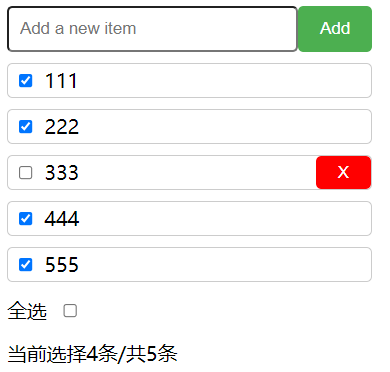

先上组件图



**功能点：**
1. 增加：在输入框输入内容，点击绿色键添加进去，添加进去后输入框内容置空（没处理空内容，个人感觉自用无所谓）
2. 删除：鼠标移到列表项可以显式红色删除键，删除该项
3. 全选：没有内容时默认不选，点击全选，取消点击就是全不选。如果所有item都被勾选，全选会自动被勾选
4. 计数：记录已经勾选的item，和总的item

> 总之要注意的就是（主要是js里）：
> 全选勾选要和todolist动态结合，比如所有item勾选了那么全选也要选上，再就是如果在全选的时候又新增item，由于新增默认是checked=false，所以全选会自动取消勾选


# js实现
**1. html代码，构建骨架**

```xml
<!DOCTYPE html>
<html lang="en">
<head>
    <meta charset="UTF-8">
    <meta name="viewport" content="width=device-width, initial-scale=1.0">
    <title>Document</title>
    <link rel="stylesheet" href="test.css">
</head>
<body>
    <div class='todo'>
        <div class='todoInput'>
            <input class='todoInputText' type='text' placeholder='Add a new item'/>
            <button class="todoInputButton">Add</button>
        </div>
        <ul class='todolist'></ul>
        <span>全选</span>
        <input class="selectAll" type='checkbox' style="margin: 20px 10px;"  defaultChecked={false}/>
        <br />  
    </div>
    <script src="./test.js"></script>
</body>
</html>
```

**2. css 样式**

```css
*{
    margin: 0;
    padding: 0;

}
.todo{
    margin-left: 10px;
}
.todoInput{
    display: flex;
}
.todoInput input{
    width: 100%;
    padding: 10px;
    border-radius: 5px;
    margin-top: 20px;
}
.todoInput button{
    padding: 5px 20px;
    border-radius: 5px;
    background-color: #4CAF50;
    color: white;
    border: none;
    cursor: pointer;
    margin-top: 20px;
}
.todo{
    width: 30%;
}

.todolist li{
    border: 1px solid #ccc;
    border-radius: 5px;
    display: flex;
    margin-top: 10px;
    height: 30px;
    line-height: 30px;
    justify-content: space-between;
}
.todolist li button {
  display: none;
  padding: 5px 20px;
  margin-left: 10px;
  background-color: red;
  color: white;
  border: none;
  border-radius: 5px;
  cursor: pointer;
}

.todolist li:hover button {
  display: block;
}
.todolist li input[type="checkbox"] {
    margin: 0 10px;
}
```

**3. js代码**

js写是真麻烦😡，我给一些步骤尽量复用了

```javascript
let todoInputText = document.querySelector(".todoInputText");
let todoInputButton = document.querySelector(".todoInputButton");
let todolist = document.querySelector(".todolist");
let listitems = [];
let todo = document.querySelector(".todo");

// 显示当前选择条数,初始化
let count = document.createElement("span");
count.textContent = '当前选择' + listitems.filter(item => item.isDone === true).length + '条/共' + listitems.length + '条';
todo.appendChild(count);

// 选择全部
let selectAll = document.querySelector(".selectAll");
// 更新函数
function updateAll() {
    count.textContent = '当前选择' + listitems.filter(item => item.isDone === true).length + '条/共' + listitems.length + '条';
    selectAll.checked = listitems.length && listitems.every(item => item.isDone === true);
}

// 为每个li元素绑定事件
todoInputButton.addEventListener("click", function () {
    //添加数组元素并绑定事件

    //更新数组元素
    let item = {};
    item.content = todoInputText.value;
    item.isDone = false;
    listitems.push(item);

    //创建li元素内部结构，并绑定事件
    let li = document.createElement("li");
    let div = document.createElement("div");
    let checkbox = document.createElement("input");
    checkbox.type = "checkbox";
    checkbox.checked = false;
    div.appendChild(checkbox);
    checkbox.addEventListener("click", function (event) {
        item.isDone = event.target.checked;
        updateAll();
    });
    let span = document.createElement("span");
    span.textContent = item.content;
    div.appendChild(span);

    //删除数组元素
    let deleteButton = document.createElement("button");
    deleteButton.textContent = "X";
    deleteButton.addEventListener("click", function (event) {
        let index = listitems.indexOf(item);
        listitems.splice(index, 1);
        event.target.parentNode.parentNode.removeChild(event.target.parentNode);
        updateAll();
    });
    li.appendChild(div);
    li.appendChild(deleteButton);
    todolist.appendChild(li);

    // 更新页面显式函数
    updateAll();
    todoInputText.value = "";

});


function updateCount(state) {
    listitems.forEach(item => item.isDone = state);
    count.textContent = '当前选择' + listitems.filter(item => item.isDone === true).length + '条/共' + listitems.length + '条';
    todolist.querySelectorAll("input[type='checkbox']").forEach((item) => item.checked = state)
}
// 选择全部
selectAll.addEventListener("click", function (event) {
    // 没有元素时不被勾选
    if (listitems.length === 0) {
        event.target.checked = false;
        return;
    }
    // 勾选全部/取消全部
    if (event.target.checked) {
        updateCount(true);
    }
    else {
        updateCount(false);
    }
});

```

# react实现

react靠hook太方便了！！！❤  一下就实现了🙁
话不多说，直接上代码

**1. jsx代码**

```javascript
import React, { useState } from 'react'
export default function Viewproject() {
    const [todolist, setTodoList]=useState([]);
    const handleTodoChange=(e,index)=>{
        let newTodoList=todolist.map((item,i)=>{
            if(i===index){
                return {...item,isDone:e.target.checked}
            }
            return item
        })
        setTodoList(newTodoList)
    }

    const input_ref=React.createRef();
  return (
    <div style={{padding: '20px'}}>
        <div>
            <div className={styles.todo}>
                <div className={styles.todoInput}>
                    <input ref={input_ref} type='text' placeholder='Add a new item'/>
                    <button onClick={()=>{setTodoList([...todolist,{checked:false,content:input_ref.current.value}]);input_ref.current.value=''}}>Add</button>
                </div>
                <ul className={styles.todolist}>
                {
                    todolist.map((item,index) => (
                        <li key={index}>
                            <div>
                                <input type='checkbox' checked={item.isDone} onChange={(e)=>handleTodoChange(e,index)}/>
                                {item.content}
                            </div>
                            <button onClick={()=>setTodoList(todolist.filter((_,i)=>i!==index))}>X</button>
                        </li>
                    ))
                }
                <span>全选</span>
                <input type='checkbox' style={{margin: '20px 10px'}} onChange={(e)=>{
                    if (e.target.checked) {
                        setTodoList(todolist.map(item=>({...item,isDone:true})))
                    }else{
                        setTodoList(todolist.map(item=>({...item,isDone:false})))
                    }
                    }} checked={todolist.length>0&&todolist.every(item=>item.isDone===true)} defaultChecked={false}/>
                <br />
                <span>当前选择{todolist.filter(item=>item.isDone).length}条/共{todolist.length}条</span>
                </ul>
            </div>
            
            
        </div>
    </div>
  )
}

```

**2. css代码**

```css
.todoInput{
    display: flex;
}
.todoInput input{
    width: 100%;
    padding: 10px;
    border-radius: 5px;
    margin-top: 20px;
}
.todoInput button{
    padding: 5px 20px;
    border-radius: 5px;
    background-color: #4CAF50;
    color: white;
    border: none;
    cursor: pointer;
    margin-top: 20px;
}
.todo{
    width: 30%;
}

.todolist li{
    border: 1px solid #ccc;
    border-radius: 5px;
    display: flex;
    margin-top: 10px;
    height: 30px;
    line-height: 30px;
    justify-content: space-between;
}
.todolist li button {
  display: none;
  padding: 5px 20px;
  margin-left: 10px;
  background-color: red;
  color: white;
  border: none;
  border-radius: 5px;
  cursor: pointer;
}

.todolist li:hover button {
  display: block;
}
.todolist li input[type="checkbox"] {
    margin: 0 10px;
}
```

